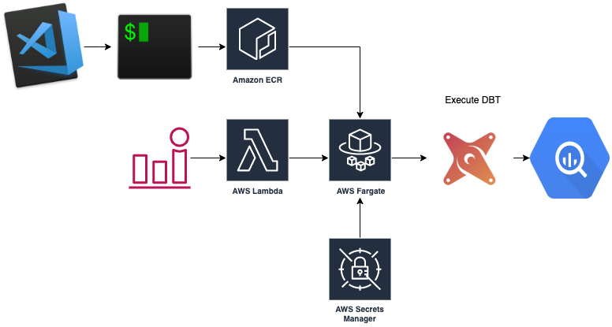

# Running DBT on AWS Fargate

First of all I want to do a big shout out to the fine folks over at Fishtown Analytics who maintain dbt at getdbt.com. They have a SaaS offering at dbt cloud which does exactly what I will show you and more - you would be wiser using their tooling and considering paying for one of the paid tiers as we definitely all benefit from their work.

## What is DBT?

It is best described by this image:


Otherwise head over to their [website](https://www.getdbt.com/)

## Getting started.



1. Create an ECR repository.
2. Jump into the Jaffle Shop directory.
3. Follow the ECR push commands to build and push the image up to the ECR.

```sh
$(aws ecr get-login --no-include-email --region ap-southeast-2)

docker build -t fargate-dbt-bigquery .

docker tag fargate-dbt-bigquery:latest <account_id>.dkr.ecr.ap-southeast-2.amazonaws.com/fargate-dbt-bigquery:latest

docker push <account_id>.dkr.ecr.ap-southeast-2.amazonaws.com/fargate-dbt-bigquery:latest
```

4. Jump into the fargate directory and deploy:

    - fargate.yaml
    - dbt-task-def.yaml

5. Jump into the sls-dbt directory and deploy the lambda function via the serverless framework.
6. Use an event to trigger the lambda function.


## GCP Instructions

```sh
gcloud builds submit --config cloudbuild.yaml .
```
